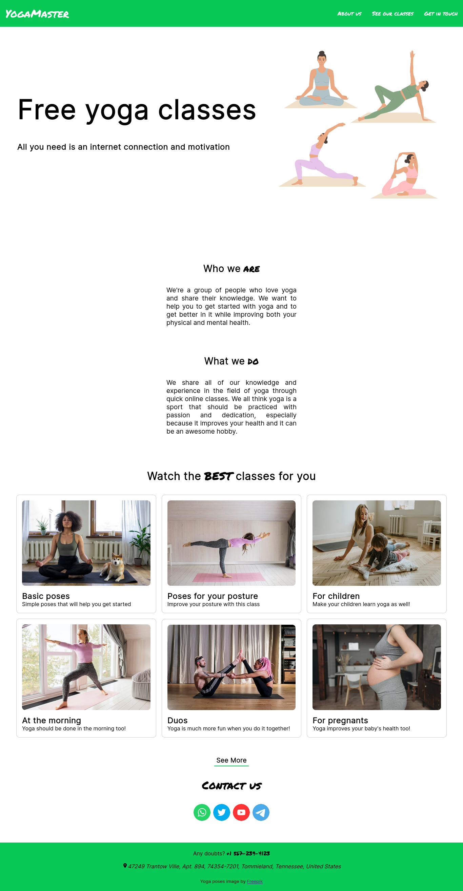
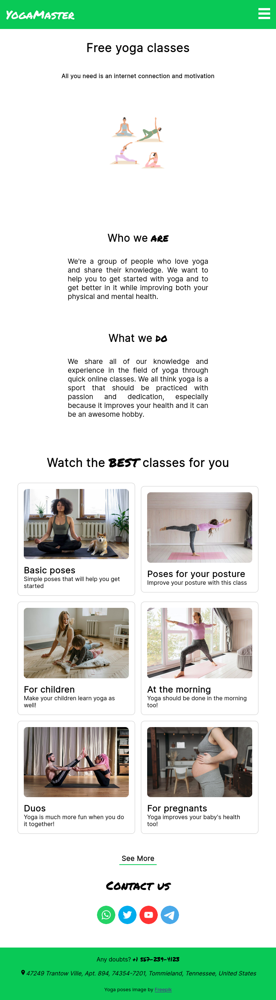
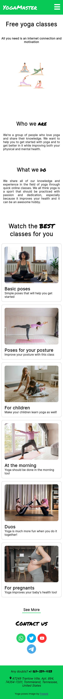

# Yoga master

A simple mockup-ish yoga website made with ReactJS.\
**WARNING**: It was made just for learning purposes, therefore there is no functionality or actual classes.

## Live
You can check out the website live [here](https://yoga-master.vercel.app/).

## Run locally
Install dependencies with
```
npm install
```
or
```
yarn
```

Then, run
```
npm run dev
```
or
```
yarn dev
```

To open a local development server.\




